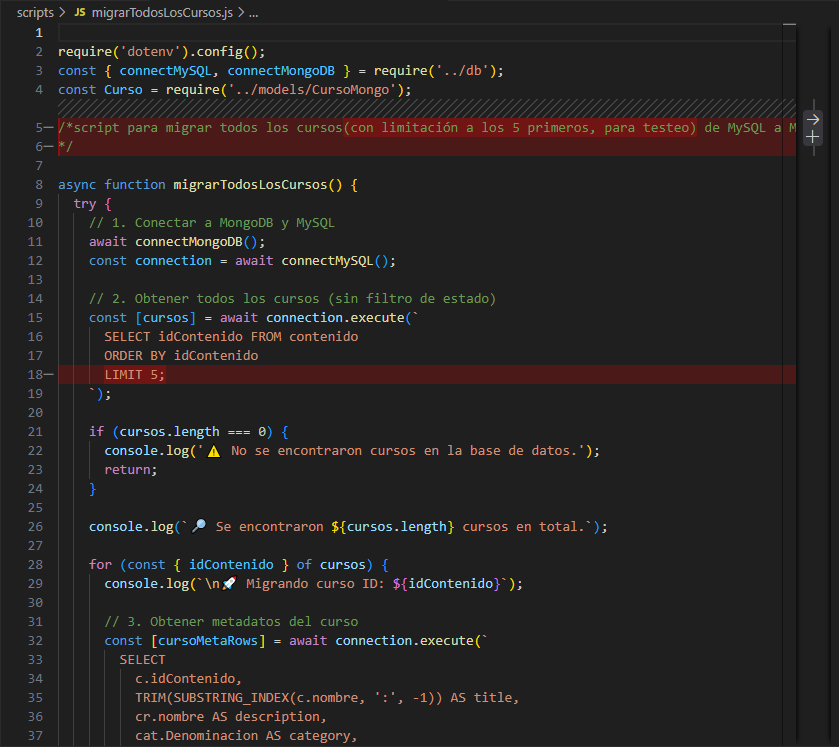

# 📚 Course Data Migration

Disco local: C:/Usuarios/Miriam Ibañez Muñoz/migracionFinal

Este proyecto migra los cursos con el modelo exacto que se requería desde MongoDB. (migrarTodosLosCursos)

Herramienta desarrollada con Node.js para migrar estructuras de cursos desde MySQL a MongoDB.  
Node.js-based tool to migrate course data structures from MySQL to MongoDB.

📦 Tecnologías / Technologies

- Node.js
- MySQL2
- Mongoose
- Dotenv

🧾 Descripción / Description

Este proyecto permite migrar información relacionada con cursos desde una base de datos relacional MySQL hacia MongoDB, adaptando la estructura para almacenar SCOs, secciones y slides como documentos anidados.

This project allows you to migrate course-related data from a relational MySQL database to MongoDB, converting SCOs, sections, and slides into nested document structures.

⚙️ Requisitos previos / Prerequisites
Antes de ejecutar el script de migración, asegúrate de tener lo siguiente:

✅ Base de datos MySQL activa
Debes tener corriendo una instancia de MySQL con acceso a las tablas contenido, sco, documentos, celdas, etc.

Las credenciales deben estar configuradas correctamente en un archivo .env.

✅ Base de datos MongoDB activa
Debes tener una conexión activa a MongoDB (local o Atlas).

El modelo Curso de Mongo debe estar definido correctamente (ver models/CursoMongo.js).

✅ Archivo .env correctamente configurado

MYSQL_HOST=localhost
MYSQL_USER=root
MYSQL_PASSWORD=tu_password
MYSQL_DATABASE=nombre_basedatos

MONGO_URI=mongodb://localhost:27017/tu_basedatos

🛠️ Uso / How to use

1. Clona el repositorio / Clone the repository

git clone https://github.com/MiriamVertice/course-data-migration.git
cd course-data-migration

2. Instala dependencias / Install dependencies

npm install

3. Configura el archivo .env

4. Ejecuta la migración / Run the migration

npm run migrar (Para migrar todos los cursos)
npm run migrarcurso (Para migrar curso 500)

Estos comandos:

Se conecta a ambas bases de datos.

Extrae todos los cursos desde MySQL.

Convierte los datos en una estructura anidada compatible con MongoDB.

Guarda cada curso en la colección correspondiente.

Omite los cursos que ya existen (por título) en MongoDB.

🔎 Detalles de migración / Migration Details

Cada curso se guarda en Mongo con los campos:

title, description, category, duration, published, sections, etc.

Cada sección incluye:

title, description, slides

Cada slide incluye:

title, description, html (y espacio para CSS en futuro)

✅ Validaciones implementadas

Se evita la duplicación de cursos ya migrados (findOne({ title })).

Se maneja la conversión de duración (duration) extrayendo el primer número de texto tipo "30 horas".

Se validan ausencias de metadatos para evitar errores en cursos incompletos.

**Para prueba desde migrarTodosLosCurso, se debería de añadir un LIMIT a la Query, tal como queda reflejado en la fotografía, o probar desde el script migrarCurso500 que solo migra dicho curso.

